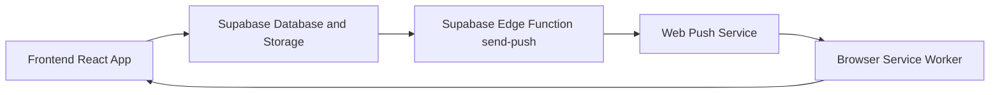

# KAK Modern Management Portal

KAK Modern is a role-based complaint management system for hostel and facility hygiene workflows.
It supports complaint registration, supervisor handling, escalation to AO, vendor visibility, admin monitoring, and push-based incoming alerts.

## 1. Project Purpose

This application helps teams manage hygiene and maintenance complaints with:

- Time-bound response windows
- Automatic escalation logic
- Multi-role dashboards
- Real-time style alerts through Service Worker notifications
- PWA install support for faster mobile access

## 2. Core Features

- Role-based login and routing for Student, Supervisor, AO, Vendor, and Master Admin
- Complaint submission with image upload support
- Status timeline for every complaint
- Escalation engine that checks deadline breaches every 10 seconds
- Black point tracking for missed supervisor deadlines
- Push notification subscription and delivery pipeline
- PWA install prompt and offline asset caching

## 3. Tech Stack

- Frontend: React 19 + TypeScript + Vite
- Routing: React Router (HashRouter)
- Styling: Tailwind CSS v4
- Backend: Supabase (Database, Storage, Edge Functions)
- Push and PWA: Service Worker + vite-plugin-pwa + Workbox
- Deployment: GitHub Pages

## 4. Folder Structure

Main source files are organized as follows:

- src/pages: role dashboards and screens
- src/services: complaint, stats, and push logic
- src/hooks: authentication and escalation engine
- src/lib: Supabase client, DB mapping, shared types/constants
- src/components: reusable UI such as PWA install prompt
- src/sw.js: custom service worker logic (polling + push + navigation messages)
- supabase/functions/send-push: edge function for server-side web push delivery

## 5. Role-Based Process Flow

### Student Process

1. Student logs in.
2. Student submits complaint (issue type, location, details, optional photo).
3. Complaint is stored in Supabase and enters pending_acceptance state.
4. Student later sees progress timeline and final status.

### Supervisor Process

1. Supervisor receives incoming alerts via Service Worker notification or push.
2. Supervisor accepts and works on complaint.
3. Supervisor updates complaint with resolution details/photo.
4. If deadlines are missed, system escalates automatically.

### AO Process

1. AO receives escalated complaints.
2. AO reviews and resolves after supervisor misses resolution window.
3. AO actions are added to complaint timeline.

### Vendor Process

- Vendor dashboard is available for operational visibility and coordination.

### Master Admin Process

- Admin has a global view for monitoring users, roles, and complaint lifecycle behavior.

## 6. Escalation Engine (Automated)

The escalation logic runs in the app through src/hooks/useEscalation.ts and checks every 10 seconds.

1. Tier 0 - Acceptance window (10 minutes)
- If supervisor does not accept in time, complaint is auto-accepted by system.
- Status moves from pending_acceptance to pending_supervisor.

2. Tier 1 - Resolution window (30 minutes)
- If unresolved after supervisor window, complaint escalates to AO.
- Status becomes pending_ao.
- First black point is assigned.

3. Tier 2 - AO overtime window (additional 30 minutes)
- If still not handled within AO window, complaint is closed as overdue.
- Status becomes closed_overdue.
- Additional black point is assigned.

## 7. Notification and PWA Process

### A. Service Worker Polling

- src/sw.js monitors pending_acceptance complaints for the assigned supervisor.
- It polls Supabase every 10 seconds.
- New unseen tickets trigger high-priority notifications.

### B. Push Subscription

- Supervisor browser subscribes using PushManager.
- Subscription data is upserted in push_subscriptions table.

### C. Push Delivery

- Frontend calls Supabase Edge Function at functions/v1/send-push.
- Edge function fetches subscription details and sends Web Push payloads.

### D. Notification Click Navigation

- Clicking notification opens or focuses the app and navigates to incoming call screen.

### E. PWA Install Prompt

- Custom install prompt is shown when browser emits beforeinstallprompt.
- App can be installed to home screen for faster access.

## 8. Local Development Setup

### Prerequisites

- Node.js 18 or later
- npm 9 or later

### Installation

1. Open the kak-modern folder.
2. Install dependencies:

```bash
npm install
```

### Run Development Server

```bash
npm run dev
```

### Build Production Bundle

```bash
npm run build
```

### Preview Production Build

```bash
npm run preview
```

### Lint

```bash
npm run lint
```

## 9. Deployment

This project is configured with base path /KAK/ and GitHub Pages deployment scripts.

```bash
npm run deploy
```

The deploy script builds first, then publishes dist through gh-pages.

## 10. Required Supabase Resources

To run this project correctly, ensure these resources exist:

- complaints table
- push_subscriptions table
- hygiene-reports storage bucket
- send-push edge function

The app expects complaint fields such as:

- ticket_id
- student_uid
- student_name
- block
- issue_type
- status
- assigned_supervisor
- acceptance_deadline
- supervisor_deadline
- ao_deadline
- timeline

## 11. Demo Credentials

The current code includes demo credentials in src/lib/types.ts for development/testing.

Examples:

- Student: 123 / Viki
- Supervisor: sup / Viki
- AO: ao / Viki
- Vendor: ven / Viki
- Admin: Vikirthan / Viki

Replace hardcoded credentials with secure authentication before production.

## 12. Important Notes for Production

- Supabase URL/keys are currently hardcoded in frontend files.
- Move keys and environment-dependent values to environment variables.
- Use secure auth and role validation on backend, not only client-side checks.
- Review Edge Function secret handling before live release.

## 13. Troubleshooting

### Notifications not appearing

- Check browser notification permission
- Confirm Service Worker is registered
- Verify push_subscriptions records in Supabase

### Complaint data not loading

- Validate Supabase URL/key
- Verify table names and column mappings
- Check console logs for KAK-DATA and KAK-LIVE messages

### PWA install prompt missing

- Prompt appears only in compatible browsers
- It will not show if app is already installed

## 14. Current Status

- Frontend architecture migrated and role dashboards are wired.
- Escalation automation is active in the app lifecycle.
- Notification flow includes both polling and push pipeline.
- Project is ready for further hardening and production security improvements.

## 15. Architecture Diagram

The following diagram represents the primary runtime flow requested for documentation.



Flow summary:

1. Frontend creates, reads, and updates complaint data in Supabase.
2. Frontend requests push delivery by calling Edge Function.
3. Edge Function fetches stored subscriptions and sends push payloads.
4. Browser push service delivers to Service Worker.
5. Service Worker displays notification and routes user back into frontend screens.

## 16. Database Schema (Example SQL Definitions)

The SQL below is an example structure aligned with current code usage. It can be adapted to your final production policy and indexing standards.

```sql
-- Required for UUID generation
create extension if not exists pgcrypto;

-- 1) Core complaints table
create table if not exists public.complaints (
	id uuid primary key default gen_random_uuid(),
	ticket_id text unique not null,
	student_uid text not null,
	student_name text not null,
	reg_no text,
	phone text,
	block text not null,
	issue_type text not null,
	description text,
	photo_url text,
	status text not null,
	submitted_at timestamptz not null default now(),
	acceptance_deadline timestamptz,
	supervisor_deadline timestamptz,
	ao_deadline timestamptz,
	assigned_supervisor text not null,
	supervisor_photo text,
	student_approved boolean,
	student_rating numeric(2,1),
	escalated boolean default false,
	timeline jsonb not null default '[]'::jsonb,
	ao_alert_at timestamptz,
	ao_missed_point_awarded boolean default false,
	resolved_at timestamptz,
	ao_resolved_at timestamptz,
	ao_resolution_photo text,
	resolved_on_time boolean,
	auto_accepted boolean default false,
	created_at timestamptz not null default now(),
	updated_at timestamptz not null default now()
);

create index if not exists idx_complaints_status on public.complaints(status);
create index if not exists idx_complaints_assigned_supervisor on public.complaints(assigned_supervisor);
create index if not exists idx_complaints_created_at on public.complaints(created_at desc);

-- 2) Push subscriptions table
create table if not exists public.push_subscriptions (
	id uuid primary key default gen_random_uuid(),
	supervisor_uid text not null,
	endpoint text not null,
	keys_p256dh text not null,
	keys_auth text not null,
	subscription_json jsonb not null,
	created_at timestamptz not null default now(),
	updated_at timestamptz not null default now(),
	unique (supervisor_uid)
);

create index if not exists idx_push_subscriptions_supervisor_uid on public.push_subscriptions(supervisor_uid);

-- 3) Supervisor stats table
create table if not exists public.supervisor_stats (
	id uuid primary key default gen_random_uuid(),
	supervisor_uid text unique not null,
	black_points integer not null default 0,
	black_point_tickets text[] not null default '{}',
	total_resolved integer not null default 0,
	total_assigned integer not null default 0,
	total_missed integer not null default 0,
	total_escalated integer not null default 0,
	resolved_on_time integer not null default 0,
	avg_rating numeric(3,1) not null default 0,
	updated_at timestamptz not null default now()
);

create index if not exists idx_supervisor_stats_avg_rating on public.supervisor_stats(avg_rating desc);
```

Recommended trigger (optional) for updated_at maintenance:

```sql
create or replace function public.set_updated_at()
returns trigger as $$
begin
	new.updated_at = now();
	return new;
end;
$$ language plpgsql;

drop trigger if exists trg_complaints_updated_at on public.complaints;
create trigger trg_complaints_updated_at
before update on public.complaints
for each row execute function public.set_updated_at();

drop trigger if exists trg_push_subscriptions_updated_at on public.push_subscriptions;
create trigger trg_push_subscriptions_updated_at
before update on public.push_subscriptions
for each row execute function public.set_updated_at();

drop trigger if exists trg_supervisor_stats_updated_at on public.supervisor_stats;
create trigger trg_supervisor_stats_updated_at
before update on public.supervisor_stats
for each row execute function public.set_updated_at();
```

## 17. API and Process Sequence (Formal Report Format)

This section documents major interaction sequences in implementation order.

### 17.1 Complaint Submission Sequence

1. Student authenticates in frontend login screen.
2. Frontend builds complaint payload and generates ticket_id.
3. Frontend uploads image to Supabase Storage bucket hygiene-reports (if provided).
4. Frontend inserts complaint row into public.complaints.
5. Complaint starts in pending_acceptance with acceptance_deadline.
6. Supervisor clients receive polling-based or push-based notification.

### 17.2 Supervisor Acceptance and Resolution Sequence

1. Supervisor opens incoming complaint view.
2. Frontend updates complaint status and timeline entries.
3. Resolution proof/photo is uploaded (if required by UI flow).
4. Frontend writes updated state back to complaints table.
5. Student and admin dashboards reflect latest timeline and status.

### 17.3 Automated Escalation Sequence

1. useEscalation background job runs every 10 seconds.
2. System checks all complaints with deadline fields.
3. If acceptance deadline is breached, complaint auto-transitions to pending_supervisor.
4. If supervisor resolution deadline is breached, complaint escalates to pending_ao and black point is added.
5. If AO deadline is also breached, complaint transitions to closed_overdue and another black point is added.

### 17.4 Push Notification Delivery Sequence

1. Frontend requests notification permission and creates PushManager subscription.
2. Subscription is upserted into public.push_subscriptions.
3. Frontend calls POST /functions/v1/send-push with supervisorUID and complaint payload.
4. Edge Function retrieves subscription_json records for target supervisor.
5. Edge Function signs VAPID headers, encrypts payload, and sends Web Push request.
6. Service Worker receives push event, displays notification, and stores navigation metadata.
7. On click, Service Worker focuses/open app and routes to incoming complaint screen.

### 17.5 Admin Monitoring Sequence

1. Admin dashboard fetches complaints and supervisor_stats snapshots.
2. Admin can review trend indicators, delete records, or reset values (as per current UI actions).
3. Updates are persisted directly to Supabase tables and reflected in dashboards.

Reference endpoints and data paths used by the current implementation:

- Supabase REST polling path: /rest/v1/complaints
- Edge Function push path: /functions/v1/send-push
- Storage bucket: hygiene-reports
- Core tables: complaints, push_subscriptions, supervisor_stats

## 18. Recommended Additional Sections

For stronger academic or professional submission quality, include the following detailed sections.

### 18.1 Non-Functional Requirements

Define measurable quality targets so system behavior can be validated objectively.

- Performance:
	- Initial dashboard load target: <= 3 seconds on standard campus Wi-Fi.
	- Complaint create/update API operations: <= 1.5 seconds median response.
	- Notification trigger latency (event to visible alert): <= 10 seconds for polling path.
- Availability:
	- Target monthly uptime: >= 99.5% for production-facing features.
	- Planned maintenance windows should be announced in advance.
- Scalability:
	- Support concurrent active users across student and supervisor roles without UI freeze.
	- Database indexing strategy must sustain growth in complaint history.
- Reliability:
	- No silent data loss for complaint submission or status transitions.
	- Retry/error visibility for failed push and upload operations.
- Usability:
	- Mobile-first behavior for supervisor incoming-call interactions.
	- Clear status labels and timeline readability for non-technical users.

### 18.2 Security and Compliance Model

Document security controls and data governance responsibilities.

- Authentication and Authorization:
	- Replace hardcoded credentials with managed authentication provider.
	- Enforce role-based authorization at database/API layer, not only frontend routes.
- Data Protection:
	- Store secrets only in environment variables and secure vaults.
	- Use HTTPS/TLS in all environments.
	- Minimize personally identifiable data retention where possible.
- Supabase Controls:
	- Enable Row Level Security (RLS) on complaints, push_subscriptions, supervisor_stats.
	- Implement policy rules for student, supervisor, AO, admin access scope.
- Audit and Monitoring:
	- Capture critical events: login, complaint state changes, escalation actions, admin resets.
	- Maintain timestamped logs for compliance and incident investigation.
- Regulatory Readiness:
	- Add consent/privacy notice where personal data is handled.
	- Define retention and deletion policy for images and contact details.

### 18.3 Test Strategy

Define how correctness is validated across components.

- Unit Testing:
	- Validate helper logic (mapping functions, countdown formatting, escalation conditions).
	- Mock Supabase client responses for deterministic test outcomes.
- Integration Testing:
	- Verify end-to-end complaint lifecycle from creation to escalation.
	- Validate push subscription persistence and edge function invocation flow.
- UI/Workflow Testing:
	- Role-based route protection and dashboard visibility checks.
	- Incoming notification navigation behavior from Service Worker click events.
- User Acceptance Testing (UAT):
	- Scenario checklist for student, supervisor, AO, vendor, and admin personas.
	- Acceptance criteria tied to timeline accuracy and status transitions.
- Regression Testing:
	- Mandatory regression suite before every release tag.
	- Include smoke checks for login, complaint submit, escalation tick, and admin page load.

### 18.4 Risk Register

Maintain a project risk log with owner, probability, impact, and mitigation.

Suggested initial entries:

- Risk: Push notifications fail due to permission denial or subscription expiration.
	- Impact: Supervisor misses urgent complaints.
	- Mitigation: Polling fallback, periodic subscription refresh, alert indicators in dashboard.
- Risk: Escalation job drift or delayed execution in inactive client sessions.
	- Impact: Deadline handling inconsistency.
	- Mitigation: Move escalation scheduler to trusted backend job/cron.
- Risk: Hardcoded keys or credentials exposed in client build.
	- Impact: Unauthorized data access.
	- Mitigation: Rotate keys, move secrets server-side, enforce RLS.
- Risk: Incorrect manual admin operations (bulk delete/reset misuse).
	- Impact: Data integrity loss.
	- Mitigation: Role restrictions, confirmation dialogs, backup and audit trail.
- Risk: Storage growth from image uploads.
	- Impact: Increased cost and slower data governance.
	- Mitigation: Retention rules, compression, archival/deletion policy.

### 18.5 Versioning and Release Governance

Define a controlled release process suitable for academic review and professional handover.

- Versioning Policy:
	- Adopt Semantic Versioning (MAJOR.MINOR.PATCH).
	- Increment:
		- MAJOR for breaking schema/API changes.
		- MINOR for new features and backward-compatible enhancements.
		- PATCH for bug fixes and documentation corrections.
- Branch and Merge Governance:
	- Protect main branch with required code review.
	- Use feature branches and pull requests for all changes.
- Release Checklist:
	- Lint/build passes.
	- Core workflows tested (submission, escalation, notifications, admin).
	- SQL migrations reviewed and applied in controlled order.
	- README and changelog updated.
- Change Log:
	- Keep release notes with date, version, changes, and migration impact.
	- Explicitly mention security fixes and configuration updates.
- Rollback Readiness:
	- Keep previous stable deployment artifact.
	- Maintain database backup/restore SOP for rollback scenarios.
