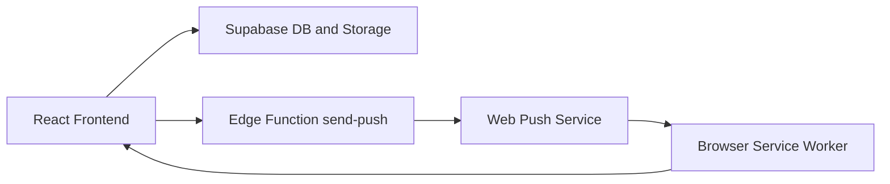

# KAK Modern Management Portal

A role-based, escalation-driven complaint management system built for campus hygiene and maintenance workflows.


## Quick Navigation

- [Overview](#overview)
- [Feature Highlights](#feature-highlights)
- [Role Journeys](#role-journeys)
- [Escalation Logic](#escalation-logic)
- [Tech Stack](#tech-stack)
- [Project Structure](#project-structure)
- [Setup and Run](#setup-and-run)
- [Supabase Requirements](#supabase-requirements)
- [Deployment](#deployment)
- [Interactive Troubleshooting](#interactive-troubleshooting)
- [Security Notes](#security-notes)
- [Architecture](#architecture)

## Overview

KAK Modern is a full workflow system where:

1. Students submit complaints.
2. Supervisors receive and resolve within deadlines.
3. AO handles escalations.
4. Vendor and Admin monitor outcomes.
5. Service Worker and push notifications improve response time.

## Feature Highlights

- Role-based dashboards: Student, Supervisor, AO, Vendor, Master Admin.
- Complaint lifecycle with timeline updates.
- Automatic escalation checks every 10 seconds.
- Black-point tracking for missed SLA windows.
- PWA install support with notification workflows.
- Supabase-backed data, storage, and edge function integration.

## Role Journeys

<details>
<summary><strong>Student Journey</strong></summary>

1. Login with role credentials.
2. Submit complaint with issue details and optional photo.
3. Track status progression and timeline.
4. Rate or review final resolution.

</details>

<details>
<summary><strong>Supervisor Journey</strong></summary>

1. Receive incoming complaint notifications.
2. Accept within the acceptance SLA.
3. Upload resolution evidence.
4. Resolve before escalation triggers.

</details>

<details>
<summary><strong>AO Journey</strong></summary>

1. Review complaints escalated by missed supervisor deadlines.
2. Take action and close escalation path.
3. Maintain accountability via timeline updates.

</details>

<details>
<summary><strong>Vendor and Master Admin Journey</strong></summary>

- Vendor views operational health and escalations.
- Admin reviews global metrics, clears stored photos, and performs controlled reset operations.

</details>

## Escalation Logic

The escalation engine runs in [src/hooks/useEscalation.ts](src/hooks/useEscalation.ts).

1. Tier 0: Acceptance window (10 minutes)
- If not accepted, auto-transition to pending_supervisor.

2. Tier 1: Supervisor resolution window (30 minutes)
- If unresolved, escalate to AO and assign black point.

3. Tier 2: AO overtime window (additional 30 minutes)
- If still unresolved, close as overdue and assign additional penalty.

## Tech Stack

- Frontend: React 19, TypeScript, Vite
- Styling: Tailwind CSS v4
- Routing: React Router (HashRouter)
- Backend: Supabase (Postgres, Storage, Edge Functions)
- Notifications: Service Worker + Web Push
- PWA: vite-plugin-pwa + Workbox
- Hosting: GitHub Pages

## Project Structure

```text
kak-modern/
  src/
    components/
    hooks/
    lib/
    pages/
    services/
    sw.js
  public/
  supabase/functions/send-push/
```

Key paths:

- [src/pages](src/pages): role pages and dashboards
- [src/services](src/services): complaint, stats, and push workflows
- [src/lib](src/lib): Supabase client, mapping, and shared types
- [src/sw.js](src/sw.js): service worker behavior
- [supabase/functions/send-push/index.ts](supabase/functions/send-push/index.ts): push delivery edge function

## Setup and Run

### Prerequisites

- Node.js 18+
- npm 9+

### Install

```bash
npm install
```

### Start Development

```bash
npm run dev
```

### Build

```bash
npm run build
```

### Preview Build

```bash
npm run preview
```

### Lint

```bash
npm run lint
```

## Supabase Requirements

Create and configure:

- complaints table
- supervisor_stats table
- push_subscriptions table
- storage bucket for complaint images
- send-push edge function

Recommended checklist:

- [ ] RLS enabled on all core tables
- [ ] SELECT, INSERT, UPDATE, DELETE policies reviewed per role
- [ ] Storage bucket policies include upload, view, delete
- [ ] Edge function environment variables configured

## Deployment

Configured for GitHub Pages with base path /KAK/.

```bash
npm run deploy
```

## Interactive Troubleshooting

<details>
<summary><strong>Notifications are not showing</strong></summary>

- Verify browser notification permission.
- Confirm service worker registration.
- Check push_subscriptions rows in Supabase.
- Confirm edge function is deployed and reachable.

</details>

<details>
<summary><strong>Complaint updates are not saving</strong></summary>

- Validate Supabase URL and key in [src/lib/supabase.ts](src/lib/supabase.ts).
- Verify table and column mappings in [src/lib/db-utils.ts](src/lib/db-utils.ts).
- Check browser console for Supabase errors.

</details>

<details>
<summary><strong>Photo delete is not working</strong></summary>

- Confirm storage delete policy exists for the active bucket.
- Ensure URL bucket/path parsing matches your stored object URLs.
- Verify bucket naming consistency.

</details>

## Demo Credentials

Configured in [src/lib/types.ts](src/lib/types.ts) for development.

- Student: 123 / Viki
- Supervisor: sup / Viki
- AO: ao / Viki
- Vendor: ven / Viki
- Admin: Vikirthan / Viki

## Security Notes

Current build is development-oriented and should be hardened before production:

- Replace hardcoded credentials with managed authentication.
- Move keys to environment variables.
- Enforce backend authorization by role.
- Add audit logs for high-impact admin actions.

## Architecture



## Status Snapshot

- Frontend migration complete.
- Escalation and role workflow active.
- Admin includes photo-only erase actions.
- Suitable for demo and iterative hardening.
